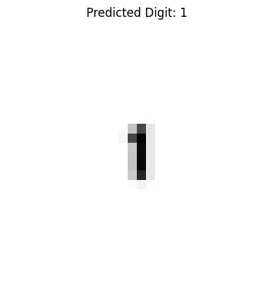

# 🧠 Handwritten Digit Recognition with CNN

This project demonstrates handwritten digit recognition using a Convolutional Neural Network (CNN) trained on the MNIST dataset.

## 🚀 Project Structure

- `digit_recognition_model.py`: Trains a CNN on MNIST and saves the model as `.h5`
- `digit_recognition_model.h5`: Trained model file
- `prediction.py`: Loads the saved model and predicts digits from uploaded images (28x28 grayscale)

## 🛠️ How to Run

### 1. Training the Model

Run the training script if you want to retrain the model:

```bash
python digit_recognition_model.py
```

This will create `digit_recognition_model.h5`.

### 2. Making Predictions

To predict digits from new images:

```bash
python prediction.py
```

You will be prompted to upload an image (must be 28x28 pixels, grayscale). The script will output the predicted digit along with a plot.

> Tip: Use Google Colab if you're facing hardware limitations.

## 🧪 Example

### 🔤 Input Image
The user provides a 28x28 grayscale image of a handwritten digit:


### ✅ Predicted Output
The model predicts the digit with high accuracy:



## 🧰 Requirements

- TensorFlow
- NumPy
- matplotlib
- PIL (Pillow)

Install with:

```bash
pip install tensorflow numpy matplotlib pillow
```

## 📦 Dataset

This project uses the [MNIST dataset](http://yann.lecun.com/exdb/mnist/), which is built into TensorFlow.

## 📜 License

This project is open-source and free to use under the MIT License.
